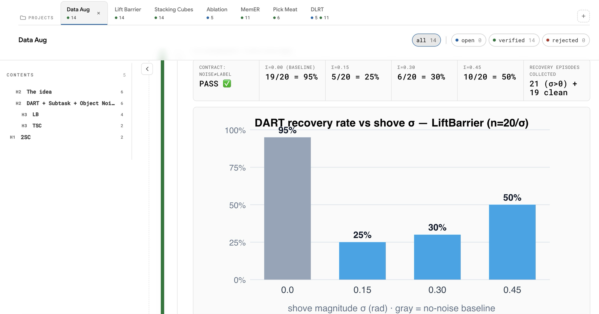
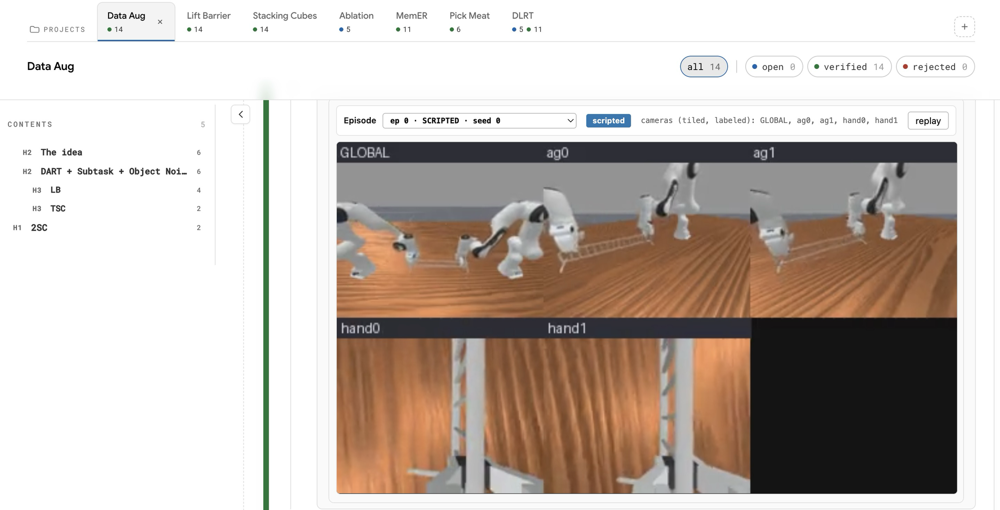

# Field Notes

Hey guys, created a notebook for ML research! I got annoyed by wandb and wanted a way to record my research results but in the age of no code, imagine google colab but no code and a way to view research results, datasets, datapoints and anything else you want to remember. Easy to present things and retain things.

## Setup

Paste this to any coding agent (Claude Code, Cursor, etc.) — it'll do everything:

> Set up "Field Notes" for me on this machine.
> 1. Make sure `uv` is installed (https://docs.astral.sh/uv/) — install it if missing.
> 2. Start it: `uvx --from git+https://github.com/themikulrai/field-notes field-notes serve`. It runs at http://127.0.0.1:8000 and keeps all data in `~/.field-notes`.
> 3. Add an MCP server named "field-notes" to my agent config so you can write to it — command `uvx`, args `--from git+https://github.com/themikulrai/field-notes field-notes-mcp`, env `FIELD_NOTES_API_URL=http://127.0.0.1:8000` and `FIELD_NOTES_KEY=local`. Restart so it loads.
> 4. Open http://127.0.0.1:8000, confirm it loads and you can list the projects, and tell me it's ready.
